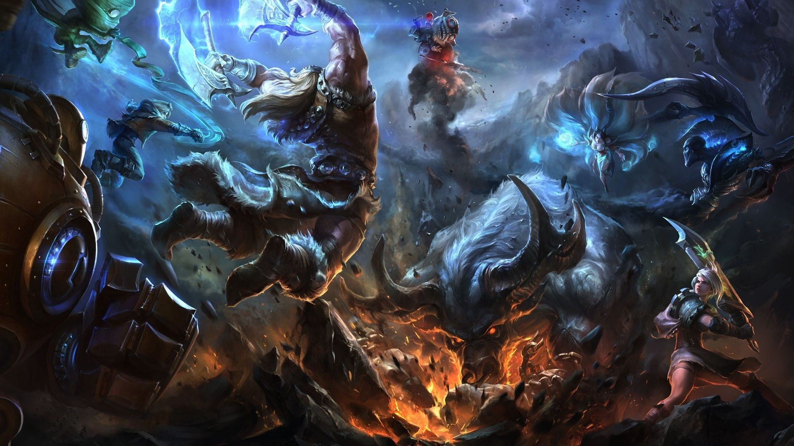

### Hi there 👋
- 📫 How to reach me: [`Personal Website`](https://kennykangmpc.github.io/Kangqi.github.io/)
- 👯 In fall 2021, I will either go to MIT to pursue Ph.D. in EECS or Courant Institute of Mathematical Sciences to pursue Ph.D. in applied and computational math.
- 🌱 I’m currently learning [`high performance computing`](https://github.com/KennyKangMPC/CS-759), [`advanced quantum computing`](https://github.com/KennyKangMPC/Physics-779), [`plasma physics`](http://mediasite.engr.wisc.edu/Mediasite/Catalog/Full/7b399ee95a21457491e921a3fe66a51b21/2139e2add08849ceae646b794c95436c14/7b399ee95a21457491e921a3fe66a51b21), [`advanced PDE`](https://www.math.wisc.edu/~jeanluc/704.php), and [`finite element methods`](https://github.com/KennyKangMPC/Math-715)
- 🔭 I’m currently working on data driven sea ice-ocean-atmosphere dynamics modeling and general system of hyperbolic equations solver
- ⚡ Fun fact: I am a grandmaster in league of legend NA and I play jungle

  

<!--
**KennyKangMPC/KennyKangMPC** is a ✨ _special_ ✨ repository because its `README.md` (this file) appears on your GitHub profile.

Here are some ideas to get you started:

- 🔭 I’m currently working on ...
- 🌱 I’m currently learning ...
- 👯 I’m looking to collaborate on ...
- 🤔 I’m looking for help with ...
- 💬 Ask me about ...
- 📫 How to reach me: ...
- 😄 Pronouns: ...
- ⚡ Fun fact: ...
-->
